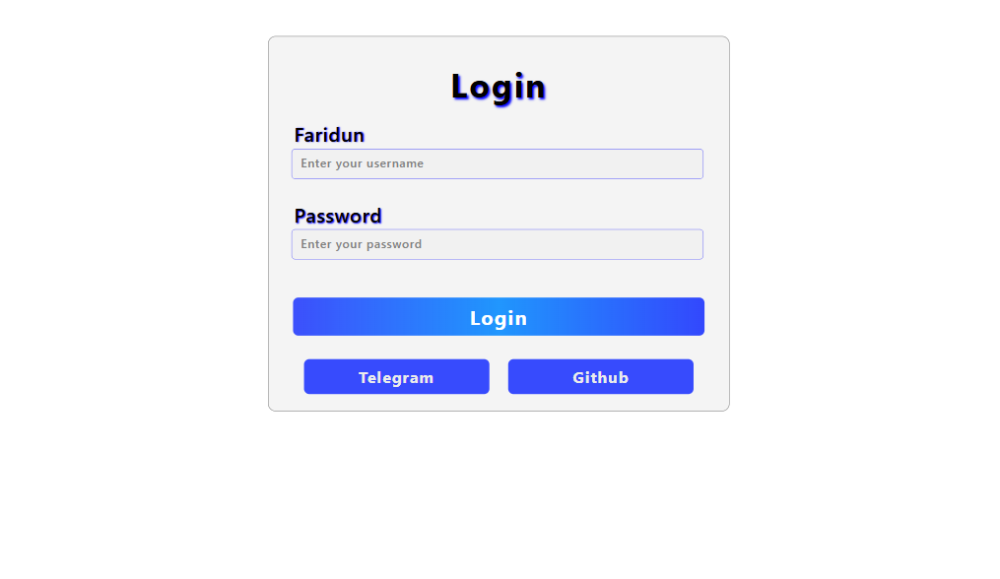
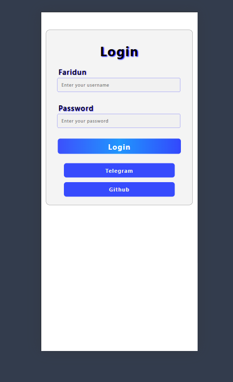

# 🔑 Login Page - Responsive Design

## 🖼 Preview
### 🖥️ Desktop View

### 📱 Mobile View

This project showcases a **responsive login page** built using **HTML and CSS**. The design ensures smooth adaptability across different screen sizes, including desktop and mobile views.

## 📌 Features
- ✨ **Minimalist & Modern UI** – Clean and user-friendly interface
- 📱 **Fully Responsive** – Works perfectly on mobile and desktop
- 🎨 **Gradient Buttons** – Stylish button effects
- 🔒 **Login Form** – Secure username and password fields
- 🌐 **Social Login Buttons** – Options for Telegram and GitHub authentication

## 🛠 Technologies Used
- **HTML5** – For structuring the login page
- **CSS3** – For styling and responsive layout
- **Flexbox** – To ensure proper alignment and responsiveness

## 🎯 Author & Contact
- **Author:** Faridun11
- **Email:** faridunfakhridinov777@gmail.com
- **GitHub:** [Faridun11](https://github.com/Faridun11)

Enjoy the project and don’t forget to ⭐ star the repository if you find it useful! 🚀

